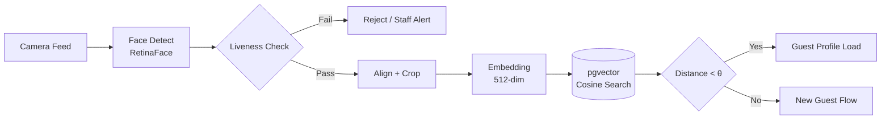
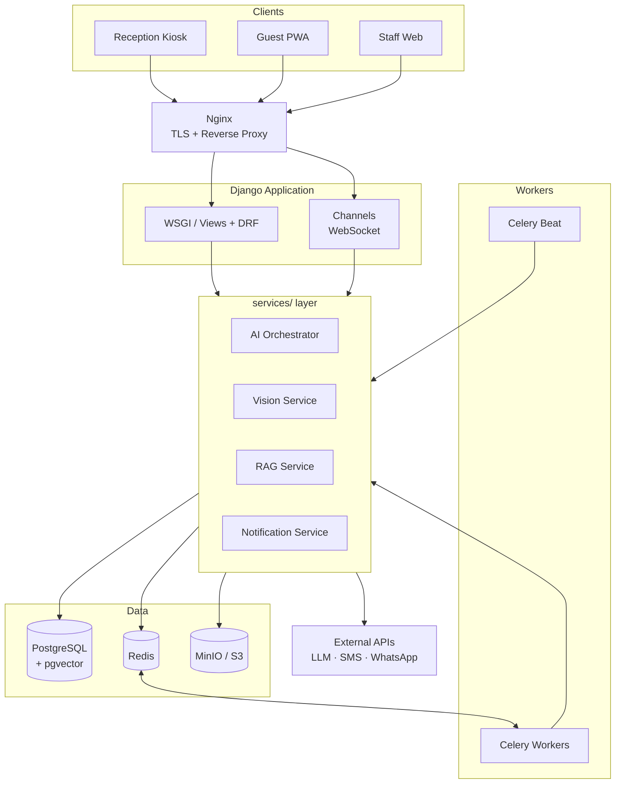

# AI Smart Hotel OS (ASHOS)
### AI-Native Hotel Management Platform — Project Concept & SRS Blueprint

| | |
|---|---|
| **Document Version** | 2.0 (Enhanced) |
| **Date** | ২ আগস্ট, ২০২৬ |
| **Status** | Draft for Approval |
| **Prepared For** | Project Stakeholders / Client |
| **Prepared By** | *[আপনার নাম / প্রতিষ্ঠান]* |
| **Classification** | Internal — Confidential |

---

## Table of Contents

1. [Executive Summary](#1-executive-summary)
2. [সিদ্ধান্ত: Technology Pivot-এর যুক্তি](#2-সিদ্ধান্ত-technology-pivot-এর-যুক্তি)
3. [Product Vision & Value Proposition](#3-product-vision--value-proposition)
4. [Scope Definition (In / Out)](#4-scope-definition-in--out)
5. [Module Architecture](#5-module-architecture)
6. [AI Center — সিস্টেমের মস্তিষ্ক](#6-ai-center--সিস্টেমের-মস্তিষ্ক)
7. [Technology Stack](#7-technology-stack)
8. [System Architecture](#8-system-architecture)
9. [Data Model & pgvector Design](#9-data-model--pgvector-design)
10. [REST API Specification (সারসংক্ষেপ)](#10-rest-api-specification-সারসংক্ষেপ)
11. [Project Structure](#11-project-structure)
12. [Non-Functional Requirements](#12-non-functional-requirements)
13. [Security, Privacy & Compliance](#13-security-privacy--compliance)
14. [Development Roadmap](#14-development-roadmap)
15. [Risk Register & Mitigation](#15-risk-register--mitigation)
16. [Success Metrics (KPI)](#16-success-metrics-kpi)
17. [SRS Deliverable Outline](#17-srs-deliverable-outline)
18. [Open Questions](#18-open-questions--সিদ্ধান্ত-প্রয়োজন)

---

## 1. Executive Summary

**ASHOS** একটি AI-Native হোটেল ম্যানেজমেন্ট প্ল্যাটফর্ম — যেখানে AI কোনো "add-on feature" নয়, বরং সিস্টেমের কেন্দ্রীয় স্থাপত্য।

প্রচলিত PMS (Property Management System) সফটওয়্যারগুলো মূলত ডেটা-এন্ট্রি টুল। ASHOS-এর পার্থক্য হলো — এটি **কথা বলে, দেখে, বোঝে এবং সিদ্ধান্ত প্রস্তাব করে**।

| বিষয় | সিদ্ধান্ত |
|---|---|
| **Platform** | Python 3.13 + Django + PostgreSQL + pgvector |
| **পরিত্যক্ত** | Oracle APEX + SQL Server |
| **Scope** | Enterprise ERP (২০০–৩০০ পৃষ্ঠা) → **AI-Centric MVP** |
| **Timeline** | ৩–৬ মাসে Production-ready MVP |
| **Core Differentiator** | AI Reception + RAG Concierge + Image Vector Search |
| **SRS Size** | ৮০–১২০ পৃষ্ঠা (IEEE 830 / ISO 29148 style) |

> **এক লাইনে:** *"একটি হোটেল সফটওয়্যার যেখানে রিসেপশনিস্ট হলো AI, আর ম্যানেজার হলো ডেটা।"*

---

## 2. সিদ্ধান্ত: Technology Pivot-এর যুক্তি

Oracle APEX + SQL Server বাদ দেওয়ার পেছনে চারটি কারণ:

| মানদণ্ড | Oracle APEX + SQL Server | Django + PostgreSQL + pgvector |
|---|---|---|
| **AI/ML Ecosystem** | দুর্বল — Python ব্রিজ লাগে | Native (PyTorch, Transformers, OpenCV সব একই প্রসেসে) |
| **Vector Search** | আলাদা ভেক্টর DB প্রয়োজন (Pinecone/Milvus) | `pgvector` — একই ডাটাবেসে, ACID-সহ |
| **Licensing Cost** | উচ্চ, per-core লাইসেন্স | সম্পূর্ণ Open Source |
| **Talent Pool (BD)** | সীমিত | বিস্তৃত ও সস্তা |
| **Deployment** | ভারী, ভেন্ডর-নির্ভর | Docker — যেকোনো VPS/Cloud-এ |

**সবচেয়ে বড় লাভ:** Embedding, Face Recognition, OCR, LLM Orchestration — সব একই Python কোডবেসে থাকবে। কোনো cross-language RPC layer লাগবে না, যা latency ও complexity দুটোই কমাবে।

**Trade-off যা স্বীকার করা উচিত:** Oracle APEX-এ CRUD স্ক্রিন তৈরি করা দ্রুততর। Django-তে সেই সময়টা ফিরে পেতে হবে `django-admin` কাস্টমাইজেশন এবং reusable CRUD template ব্যবহার করে।

---

## 3. Product Vision & Value Proposition

### 3.1 Vision Statement

> ২০২৭ সালের মধ্যে দক্ষিণ এশিয়ার small-to-mid scale হোটেলগুলোর জন্য প্রথম সাশ্রয়ী AI-Native PMS হয়ে ওঠা, যা রিসেপশন খরচ ৪০% কমাবে এবং গেস্ট সন্তুষ্টি বাড়াবে।

### 3.2 Target Segment

| Segment | Room Count | কেন ASHOS |
|---|---|---|
| Boutique Hotel | ১০–৪০ | ২৪/৭ রিসেপশন স্টাফ রাখার খরচ বাঁচে |
| Mid-scale Hotel | ৪০–১৫০ | Housekeeping ও Upsell অটোমেশন |
| Resort | ৩০–১০০ | Multi-language গেস্ট (বিদেশি পর্যটক) |
| Serviced Apartment | ২০–৮০ | Contactless/Self check-in |

### 3.3 Value Proposition (তিন স্তরে)

**গেস্টের জন্য —** লাইনে দাঁড়ানো নেই, ফর্ম পূরণ নেই, ভাষার বাধা নেই। মুখ দেখিয়ে চেক-ইন, নিজের ভাষায় প্রশ্ন।

**স্টাফের জন্য —** পুনরাবৃত্তিমূলক প্রশ্নের উত্তর AI দেবে; স্টাফ শুধু ব্যতিক্রম সামলাবে। Housekeeping-এর অগ্রাধিকার AI ঠিক করে দেবে।

**মালিকের জন্য —** কম স্টাফে বেশি রুম, প্রতিটি গেস্ট-ইন্টারঅ্যাকশনের ডেটা, এবং AI-চালিত upsell।

---

## 4. Scope Definition (In / Out)

স্কোপ ক্রিপ এই প্রজেক্টের সবচেয়ে বড় ঝুঁকি। তাই স্পষ্টভাবে সীমা টানা হচ্ছে:

### ✅ MVP-তে থাকবে

- AI Reception (Voice + Text + Face)
- Reservation & Check-in / Check-out
- Guest Mobile App (PWA)
- Housekeeping (AI Priority)
- Restaurant (Basic POS + Room Service)
- Billing & Invoice
- AI Center (Admin Control Panel)
- RAG Knowledge Base
- Image Vector Search

### ❌ MVP-তে থাকবে **না** (Phase 2+)

| বাদ দেওয়া হচ্ছে | কারণ |
|---|---|
| Payroll / HRM | সম্পূর্ণ আলাদা ডোমেইন |
| Full Accounting (Ledger, Trial Balance) | Accounting সফটওয়্যারের কাজ; শুধু export দেওয়া হবে |
| Inventory / Store Management | Restaurant-এর জন্য পরে |
| Channel Manager (Booking.com, Agoda sync) | তৃতীয় পক্ষের API, উচ্চ জটিলতা |
| Multi-property / Chain Management | Single-property দিয়ে শুরু |
| Banquet & Event Management | পরে |
| Object Detection (লাগেজ শনাক্তকরণ) | R&D পর্যায়ে, MVP-তে ঝুঁকিপূর্ণ |
| Door Lock Integration | হার্ডওয়্যার-নির্ভর |

---

## 5. Module Architecture

মোট **৯টি Functional Module** + ১টি Control Plane (AI Center)।

| # | Module | Priority | Complexity | AI-Driven? |
|---|---|---|---|---|
| 1 | AI Reception | 🔴 P0 | উচ্চ | ✅ Core |
| 2 | Reservation & Check-in | 🔴 P0 | মধ্যম | ⚡ Partial |
| 3 | Rooms & Inventory | 🔴 P0 | নিম্ন | ➖ |
| 4 | Guest App (PWA) | 🟠 P1 | মধ্যম | ⚡ Partial |
| 5 | Housekeeping | 🟠 P1 | নিম্ন | ⚡ Partial |
| 6 | Restaurant | 🟡 P2 | মধ্যম | ➖ |
| 7 | Billing | 🔴 P0 | মধ্যম | ⚡ Partial |
| 8 | Vision (Face + OCR) | 🔴 P0 | উচ্চ | ✅ Core |
| 9 | RAG + Vector Search | 🔴 P0 | উচ্চ | ✅ Core |

---

### Module 1 — AI Reception 🔴

**এটাই সফটওয়্যারের প্রাণ।** অন্য সব মডিউল এই মডিউলকে সেবা দেয়।

| Feature | বিবরণ | Acceptance Criteria |
|---|---|---|
| AI Avatar Receptionist | ব্রাউজারে অ্যানিমেটেড অবতার, lip-sync সহ | Kiosk-এ ফুল-স্ক্রিন চলবে |
| Voice Conversation | Whisper (STT) → LLM → TTS | End-to-end latency < ৩ সেকেন্ড |
| Text Chat | টাইপ করে কথা বলা | Streaming response |
| Face Recognition | রিটার্নিং গেস্ট শনাক্তকরণ | Accuracy > ৯৫% (good lighting) |
| Face Registration | সম্মতিসহ এনরোলমেন্ট | Explicit consent capture বাধ্যতামূলক |
| Guest Verification | Face ↔ ID Document ম্যাচিং | Confidence score লগ হবে |
| Passport / NID OCR | ডকুমেন্ট থেকে ফিল্ড এক্সট্রাকশন | MRZ parsing সহ; ৯০%+ field accuracy |
| AI Concierge | RAG-ভিত্তিক প্রশ্নোত্তর | উত্তরে source citation থাকবে |
| Multi-language | বাংলা, ইংরেজি, হিন্দি, আরবি, চীনা | Auto language detection |

**Fallback নিয়ম (গুরুত্বপূর্ণ):** AI-এর confidence থ্রেশহোল্ডের নিচে গেলে বা গেস্ট দুইবার একই প্রশ্ন করলে → **স্বয়ংক্রিয়ভাবে মানব স্টাফকে নোটিফাই** করবে। AI কখনো গেস্টকে আটকে রাখবে না।

---

### Module 2 — Reservation & Check-in 🔴

- Online Booking (পাবলিক পোর্টাল)
- Walk-in Booking (রিসেপশন)
- Real-time Room Availability (double-booking prevention সহ DB constraint)
- QR Check-in
- Face Check-in
- Digital Signature (canvas → PNG → immutable storage)
- **AI Room Recommendation** — গেস্টের অতীত পছন্দ + বর্তমান availability + upsell margin বিবেচনা করে

---

### Module 3 — Rooms & Inventory 🔴

Room Type, Rate Plan, Room Status (Vacant Clean / Vacant Dirty / Occupied / Out of Order), Amenities, Room Image Gallery (vector-indexed), Seasonal Pricing।

---

### Module 4 — Guest App (PWA) 🟠

**সিদ্ধান্ত:** Native app নয়, **PWA** — কারণ App Store approval, দুইটি কোডবেস ও রক্ষণাবেক্ষণ খরচ MVP-তে অযৌক্তিক।

গেস্ট পারবেন: AI-এর সাথে চ্যাট · রুম বুক · খাবার অর্ডার · হাউসকিপিং রিকোয়েস্ট · চেকআউট · বিল দেখা · নোটিফিকেশন পাওয়া।

---

### Module 5 — Housekeeping 🟠

**AI Priority Score** নির্ধারণের ইনপুট:

```
Priority Score = w₁ × (আগত গেস্টের ETA পর্যন্ত সময়)
               + w₂ × (রুমের VIP/loyalty tier)
               + w₃ × (রুমের অপরিষ্কার থাকার সময়কাল)
               + w₄ × (তলা অনুযায়ী staff-এর নৈকট্য)
               + w₅ × (early check-in রিকোয়েস্ট আছে কি)
```

> **নোট:** MVP-তে এটি LLM নয়, **weighted rule engine** — নির্ভরযোগ্য, ব্যাখ্যাযোগ্য ও দ্রুত। ওয়েটগুলো AI Center থেকে টিউনযোগ্য হবে। পর্যাপ্ত ডেটা জমলে Phase 3-এ ML মডেল।

Features: Dirty Room Queue · Task Assignment · Cleaning Status · Photo Verification · AI Priority Score

---

### Module 6 — Restaurant 🟡

সচেতনভাবে **ছোট** রাখা হচ্ছে: Menu (category, item, modifier) · Order (dine-in / room service) · Kitchen Display · Bill → Room Folio-তে পোস্ট।

---

### Module 7 — Billing 🔴

Folio-based billing · Invoice (VAT/Tax সহ) · Payment (Cash, Card, bKash/Nagad, Bank) · Split Bill · Due Reminder · Checkout Settlement · Night Audit।

**AI Proactive Notification —** Checkout-এর ১২ ঘণ্টা আগে Celery Beat টাস্ক ট্রিগার করবে:

```
Checkout − 12h  →  AI Message Composer (গেস্টের ভাষায়)
                →  SMS + WhatsApp + Push
                →  বার্তায় থাকবে: বকেয়া বিল, চেকআউট সময়,
                   late-checkout অফার (upsell), ফিডব্যাক লিংক
```

---

### Module 8 — Vision 🔴

#### 8.1 Face Recognition Pipeline



> **Liveness Detection মূল ধারায় যোগ করা হয়েছে** — এটি ছাড়া ছাপানো ছবি দিয়েই চেক-ইন সম্ভব হয়ে যাবে, যা একটি নিরাপত্তা ছিদ্র।

#### 8.2 OCR

Passport (MRZ সহ) · Driving License · NID (বাংলাদেশ Smart Card) · Vendor Invoice।

Engine: **PaddleOCR** (বাংলা সাপোর্ট ভালো) → fallback **Tesseract**। MRZ-এর জন্য আলাদা checksum validation।

#### 8.3 Object Detection — *Phase 3, Deferred*

লাগেজ শনাক্তকরণ → Bellboy নোটিফিকেশন। MVP-তে **নয়**।

---

### Module 9 — RAG + Image Vector Search 🔴

#### 9.1 Text RAG

| স্তর | বাস্তবায়ন |
|---|---|
| Knowledge Source | Hotel Policy, FAQ, Menu, Rules, Emergency Info, Tourist Guide, PDF, DOCX |
| Chunking | ৫০০ token, ৫০ token overlap, heading-aware |
| Embedding | Sentence Transformers (multilingual — বাংলা সাপোর্ট আবশ্যক) |
| Store | `pgvector` + HNSW index |
| Retrieval | Hybrid: Vector similarity + PostgreSQL full-text search |
| Re-rank | Cross-encoder (optional, Phase 2) |
| Generation | LLM + strict "context-only" system prompt |
| Guardrail | context-এ উত্তর না থাকলে → "জানি না, স্টাফকে ডাকছি" |

#### 9.2 Hotel Image Vector Search — *প্রকৃত Differentiator*

**উদ্দেশ্য:** হোটেলের সব ছবি (Room, Lobby, Restaurant, Gym, Pool, Spa, Conference Hall) সেমান্টিক্যালি সার্চযোগ্য করা।

```
Image Upload → CLIP Vision Encoder → Embedding → pgvector
                                                     ↑
Text Query "sea view room" → CLIP Text Encoder ──────┘
                                                     ↓
                                          Ranked Image + Room Results
```

**কেন কাজ করে:** CLIP একই ভেক্টর স্পেসে ছবি ও টেক্সট ম্যাপ করে — তাই ম্যানুয়াল ট্যাগিং ছাড়াই natural language দিয়ে ছবি খোঁজা যায়।

উদাহরণ ক্যোয়ারি: *"Sea view room"* · *"Room with balcony"* · *"Conference hall for 100 people"* · *"Swimming pool at night"*

**ব্যবহারের ক্ষেত্র:**

| Use Case | মূল্য |
|---|---|
| AI Room Recommendation | গেস্ট বর্ণনা দিবে, AI রুম দেখাবে |
| Similar Room Search | পছন্দের রুম booked হলে বিকল্প |
| Lost & Found Image Matching | হারানো জিনিসের ছবি → ম্যাচ |
| Interior Style Search | রেনোভেশন প্ল্যানিং |
| Marketing Gallery Search | মার্কেটিং টিমের দ্রুত অ্যাসেট খোঁজা |

---

## 6. AI Center — সিস্টেমের মস্তিষ্ক

সব AI কনফিগারেশন একটি জায়গায়। **কোড ডিপ্লয় ছাড়াই AI-এর আচরণ বদলানো যাবে** — এটি অপারেশনালি অত্যন্ত গুরুত্বপূর্ণ।

### 6.1 Models
LLM · Embedding Model · OCR Engine · Face Model · TTS Voice — প্রতিটির জন্য provider, endpoint, model name, temperature, max token, timeout, fallback model।

### 6.2 Prompts (Versioned)
System Prompt · Reception Prompt · Restaurant Prompt · Housekeeping Prompt · Notification Composer Prompt

> প্রতিটি প্রম্পট **version-controlled** থাকবে এবং rollback করা যাবে। একটি খারাপ প্রম্পট এডিট যেন পুরো রিসেপশন ভেঙে না ফেলে।

### 6.3 Knowledge Base (RAG)
Upload PDF / DOCX / Image / Policy · Chunk Preview · Re-embed · **Rebuild Vector Index** · Source-wise enable/disable

### 6.4 Observability
Conversation Log · Token Usage & Cost (per module) · Latency (p50 / p95 / p99) · Error Rate · Guardrail Trigger Count · Human-handoff Rate

### 6.5 Safety Controls
Confidence Threshold · Blocked Topic List · Max Conversation Turn · **Kill Switch** (AI বন্ধ করে manual mode-এ যাওয়া)

---

### Admin Dashboard — ঠিক ৮টি মেনু

| # | Menu | কী থাকবে |
|---|---|---|
| 1 | **Dashboard** | Occupancy, ADR, RevPAR, আজকের arrival/departure, AI health |
| 2 | **Reception** | Live AI conversation, walk-in, handoff queue |
| 3 | **Guests** | Profile, history, face enrollment, documents |
| 4 | **Rooms** | Status board, rate, image gallery |
| 5 | **Housekeeping** | Priority queue, task board |
| 6 | **Restaurant** | Menu, orders, KDS |
| 7 | **AI Center** | উপরের সব |
| 8 | **Settings** | Hotel profile, users, RBAC, tax, integration |

> Billing আলাদা মেনু নয় — Guest folio ও Checkout ফ্লো-এর ভেতরেই থাকবে, কারণ সেখানেই এটি ব্যবহৃত হয়।

---

## 7. Technology Stack

### Backend
| Component | Choice | ভূমিকা |
|---|---|---|
| Language | Python 3.13 | — |
| Framework | Django 5.x | ORM, Admin, Auth |
| API | Django REST Framework | REST + JWT |
| Realtime | Django Channels + WebSocket | Voice/Chat streaming |
| Async Task | Celery + Redis | Embedding, OCR, Notification |
| Scheduler | Celery Beat | Night audit, reminder |

### Frontend
Bootstrap 5 · JavaScript (ES6, vanilla + Alpine.js) · HTML5 · CSS3 · Web Audio API (voice capture) · MediaDevices API (camera)

> **সিদ্ধান্ত:** React/Vue নয়। Django template + Bootstrap + Alpine.js যথেষ্ট, এবং একজন সলো ডেভেলপারের জন্য দ্রুততর।

### Database
PostgreSQL 16+ · **pgvector** (HNSW index) · Redis (cache + broker)

### AI Layer
| উদ্দেশ্য | টুল |
|---|---|
| LLM | OpenAI-compatible API (vendor-agnostic wrapper) |
| Embedding (Text) | Sentence Transformers — multilingual |
| Embedding (Image) | CLIP / open_clip |
| Face Detection | RetinaFace |
| Face Recognition | InsightFace (ArcFace) |
| OCR | PaddleOCR → Tesseract fallback |
| STT | Whisper |
| TTS | Piper / Coqui / Cloud TTS |

> ⚠️ **Licensing সতর্কতা:** InsightFace-এর কিছু pretrained মডেল **non-commercial** লাইসেন্সের অধীনে। বাণিজ্যিক ডিপ্লয়মেন্টের আগে প্রতিটি মডেল ওয়েটের লাইসেন্স যাচাই করতে হবে, নয়তো commercial-friendly বিকল্প (যেমন licensed API) ব্যবহার করতে হবে। এটি একটি blocking legal item।

### Storage & Infra
MinIO / S3-compatible (media) · PostgreSQL (metadata) · Docker + Docker Compose · Nginx (reverse proxy + TLS) · Prometheus + Grafana (optional)

### Abstraction নীতি
সব AI কল একটি `services/ai/` লেয়ারের মধ্য দিয়ে যাবে। **কোনো ভিউ সরাসরি OpenAI SDK কল করবে না।** এতে মডেল/ভেন্ডর পরিবর্তন এক জায়গায় সীমাবদ্ধ থাকবে।

---

## 8. System Architecture



---

## 9. Data Model & pgvector Design

### 9.1 মূল টেবিল (সারসংক্ষেপ)

| Domain | Tables |
|---|---|
| Guest | `guest`, `guest_document`, `guest_face`, `guest_preference` |
| Room | `room_type`, `room`, `room_status_log`, `room_image`, `rate_plan` |
| Booking | `reservation`, `reservation_room`, `check_in`, `check_out` |
| Housekeeping | `hk_task`, `hk_assignment`, `hk_priority_snapshot` |
| Restaurant | `menu_category`, `menu_item`, `order`, `order_item` |
| Billing | `folio`, `folio_line`, `invoice`, `payment` |
| AI | `ai_conversation`, `ai_message`, `ai_model_config`, `ai_prompt_version`, `ai_usage_log` |
| RAG | `kb_document`, `kb_chunk` |

### 9.2 Vector Column ডিজাইন

```sql
CREATE EXTENSION IF NOT EXISTS vector;

-- Text knowledge chunks
CREATE TABLE kb_chunk (
    id           BIGSERIAL PRIMARY KEY,
    document_id  BIGINT NOT NULL REFERENCES kb_document(id) ON DELETE CASCADE,
    chunk_index  INT    NOT NULL,
    content      TEXT   NOT NULL,
    token_count  INT,
    embedding    VECTOR(768),          -- multilingual model dimension
    created_at   TIMESTAMPTZ DEFAULT now()
);

CREATE INDEX kb_chunk_embed_idx ON kb_chunk
    USING hnsw (embedding vector_cosine_ops)
    WITH (m = 16, ef_construction = 64);

-- Full-text search (hybrid retrieval-এর জন্য)
CREATE INDEX kb_chunk_fts_idx ON kb_chunk
    USING gin (to_tsvector('simple', content));


-- Face embeddings
CREATE TABLE guest_face (
    id           BIGSERIAL PRIMARY KEY,
    guest_id     BIGINT NOT NULL REFERENCES guest(id) ON DELETE CASCADE,
    embedding    VECTOR(512) NOT NULL,   -- ArcFace
    quality      REAL,
    consent_at   TIMESTAMPTZ NOT NULL,   -- সম্মতি ছাড়া রেকর্ড নয়
    expires_at   TIMESTAMPTZ,            -- retention policy
    created_at   TIMESTAMPTZ DEFAULT now()
);

CREATE INDEX guest_face_embed_idx ON guest_face
    USING hnsw (embedding vector_cosine_ops);


-- Hotel image embeddings (CLIP)
CREATE TABLE hotel_image (
    id           BIGSERIAL PRIMARY KEY,
    room_id      BIGINT REFERENCES room(id) ON DELETE SET NULL,
    category     VARCHAR(50),   -- room | lobby | pool | gym | spa | hall
    storage_key  TEXT NOT NULL,
    caption      TEXT,
    embedding    VECTOR(512) NOT NULL,   -- CLIP image/text shared space
    created_at   TIMESTAMPTZ DEFAULT now()
);

CREATE INDEX hotel_image_embed_idx ON hotel_image
    USING hnsw (embedding vector_cosine_ops);
```

### 9.3 ডিজাইন নোট

- **Dimension লক করুন আগে।** Embedding মডেল বদলালে পুরো টেবিল re-embed করতে হবে — তাই `ai_model_config`-এ ব্যবহৃত মডেল ও ডাইমেনশন রেকর্ড রাখুন।
- **HNSW vs IVFFlat:** HNSW ব্যবহার করুন — recall ভালো এবং insert-এর সময় training লাগে না।
- **Face search-এ pre-filter করুন।** সব গেস্ট নয়, শুধু active/recent গেস্টদের মধ্যে খুঁজুন — গতি বহুগুণ বাড়বে।
- **Retention:** face embedding-এ `expires_at` বাধ্যতামূলক; একটি Celery Beat টাস্ক মেয়াদোত্তীর্ণ বায়োমেট্রিক ডেটা মুছবে।

---

## 10. REST API Specification (সারসংক্ষেপ)

| Method | Endpoint | উদ্দেশ্য |
|---|---|---|
| `POST` | `/api/v1/auth/token/` | JWT ইস্যু |
| `POST` | `/api/v1/reception/chat/` | AI চ্যাট (streaming) |
| `WS` | `/ws/reception/voice/` | Voice স্ট্রিম |
| `POST` | `/api/v1/vision/face/identify/` | ফেস ম্যাচিং |
| `POST` | `/api/v1/vision/face/enroll/` | সম্মতিসহ এনরোলমেন্ট |
| `POST` | `/api/v1/vision/ocr/` | ডকুমেন্ট OCR |
| `GET` | `/api/v1/rooms/availability/` | Availability query |
| `POST` | `/api/v1/reservations/` | বুকিং তৈরি |
| `POST` | `/api/v1/checkin/` | চেক-ইন |
| `POST` | `/api/v1/search/images/` | সেমান্টিক ইমেজ সার্চ |
| `POST` | `/api/v1/rag/query/` | Knowledge query |
| `GET` | `/api/v1/housekeeping/queue/` | Priority queue |
| `POST` | `/api/v1/restaurant/orders/` | অর্ডার |
| `GET` | `/api/v1/billing/folio/{id}/` | Folio |
| `POST` | `/api/v1/billing/checkout/` | সেটেলমেন্ট |

**কনভেনশন:** সব endpoint version-prefixed · Cursor pagination · RFC 7807 error format · Idempotency-Key হেডার (payment ও booking-এ) · OpenAPI schema auto-generated (`drf-spectacular`)।

---

## 11. Project Structure

```
hotel_ai/
│
├── apps/
│   ├── core/               # base model, mixin, utils
│   ├── accounts/           # user, RBAC, audit log
│   ├── reception/          # AI reception, conversation
│   ├── booking/            # reservation, check-in/out
│   ├── rooms/              # room, type, rate, gallery
│   ├── guests/             # profile, document, consent
│   ├── housekeeping/       # task, priority engine
│   ├── restaurant/         # menu, order, KDS
│   ├── billing/            # folio, invoice, payment
│   ├── ai_center/          # model config, prompt, logs
│   ├── vision/             # face, OCR
│   ├── rag/                # KB, chunking, retrieval
│   ├── vector_search/      # image semantic search
│   ├── notifications/      # SMS, WhatsApp, push
│   └── dashboard/          # KPI, analytics
│
├── api/                    # DRF routers, serializers, schema
├── services/               # ⭐ business logic layer
│   ├── ai/                 # LLM client, orchestrator, guardrail
│   ├── vision/             # face pipeline, OCR pipeline
│   ├── rag/                # embed, chunk, retrieve, rerank
│   ├── notification/       # channel adapters
│   └── billing/            # folio calculation, tax
├── templates/
├── static/
├── media/
├── ai_models/              # local model weights (git-ignored)
├── embeddings/             # cache, migration scripts
├── tests/
│   ├── unit/
│   ├── integration/
│   └── ai_eval/            # ⭐ prompt regression tests
├── deploy/
│   ├── docker/
│   ├── nginx/
│   └── compose.yml
└── config/                 # settings/{base,dev,prod}.py
```

**দুটি সংযোজন যা মূলে ছিল না:**
- `services/` লেয়ারটি এখন প্রথম-শ্রেণির নাগরিক — সব ব্যবসায়িক লজিক এখানে, ভিউতে নয়।
- `tests/ai_eval/` — AI আউটপুটের জন্য regression test। প্রম্পট বদলালে ৩০টি পরিচিত প্রশ্ন চালিয়ে দেখা হবে উত্তর খারাপ হয়েছে কি না। **AI প্রজেক্টে এটি ছাড়া নিরাপদে iterate করা অসম্ভব।**

---

## 12. Non-Functional Requirements

| ক্যাটেগরি | প্রয়োজনীয়তা | লক্ষ্যমাত্রা |
|---|---|---|
| **Performance** | AI text response (first token) | < ১.৫ সেকেন্ড |
| | Voice round-trip | < ৩ সেকেন্ড |
| | Face identification | < ১ সেকেন্ড |
| | Page load (p95) | < ২ সেকেন্ড |
| | Vector search (১০ লক্ষ রেকর্ড) | < ২০০ ms |
| **Scalability** | Concurrent guest session | ১০০+ |
| | Room capacity | ৫০০ রুম পর্যন্ত single instance |
| **Availability** | Uptime | ৯৯.৫% |
| | AI ব্যর্থ হলে | সিস্টেম manual mode-এ চলবে (graceful degradation) |
| **Reliability** | Backup | দৈনিক full + WAL archiving |
| | RPO / RTO | ১ ঘণ্টা / ৪ ঘণ্টা |
| **Usability** | ভাষা | বাংলা + ইংরেজি UI |
| | Staff training | ২ ঘণ্টার মধ্যে অপারেশনাল |
| **Accessibility** | Kiosk | হুইলচেয়ার-উপযোগী উচ্চতা, বড় ফন্ট, voice-first |
| **Maintainability** | Test coverage | > ৭০% (services layer-এ > ৮৫%) |
| **Cost** | AI cost per guest-stay | নির্ধারিত সীমা + budget alert |
| **Offline** | ইন্টারনেট বিচ্ছিন্ন হলে | Local check-in queue, পরে sync |

> **Offline requirement-টি বিশেষভাবে গুরুত্বপূর্ণ।** ক্লাউড LLM-নির্ভর সিস্টেমে ইন্টারনেট গেলে রিসেপশন সম্পূর্ণ অচল হয়ে যেতে পারে — যা একটি হোটেলের জন্য অগ্রহণযোগ্য।

---

## 13. Security, Privacy & Compliance

### 13.1 Application Security
JWT (short-lived access + refresh) · RBAC (Admin / Manager / Reception / Housekeeping / Restaurant / Accountant) · Object-level permission · Audit Log (কে, কী, কখন, কোন IP) · Rate limiting · CSRF/XSS/SQLi protection (Django default + review) · Secret management (env / vault, কখনো git-এ নয়) · TLS everywhere।

### 13.2 AI-নির্দিষ্ট নিরাপত্তা

| ঝুঁকি | প্রতিকার |
|---|---|
| **Prompt Injection** | আপলোড করা ডকুমেন্ট ও গেস্ট ইনপুট = **ডেটা, নির্দেশ নয়**। System prompt-এ স্পষ্ট boundary; retrieved content আলাদা ডিলিমিটারে। |
| **Data Leakage** | AI কখনো অন্য গেস্টের তথ্য দেখবে না — retrieval-এ tenant/guest scoping বাধ্যতামূলক। |
| **Hallucination** | Context-only prompt + citation + confidence threshold + "জানি না" fallback। |
| **Cost Attack** | Per-session token cap, rate limit, anomaly alert। |
| **Model Output Trust** | AI কোনো আর্থিক লেনদেন বা refund নিজে সম্পন্ন করবে না — শুধু প্রস্তাব দেবে, মানুষ অনুমোদন করবে। |

### 13.3 Biometric Privacy — ⚠️ Blocking Concern

মুখের ডেটা **sensitive biometric personal data**। এটি নিছক একটি টেকনিক্যাল ফিচার নয়, একটি আইনি দায়।

**বাধ্যতামূলক নিয়ম:**

1. **Explicit, informed, opt-in consent** — চেক-ইনের সময় লিখিতভাবে; সম্মতির টাইমস্ট্যাম্প ডাটাবেসে সংরক্ষিত।
2. **সবসময় বিকল্প পথ থাকবে** — গেস্ট ফেস স্ক্যান প্রত্যাখ্যান করলে স্বাভাবিক চেক-ইন পাবেন, কোনো অসুবিধা ছাড়া।
3. **Embedding সংরক্ষণ করুন, ছবি নয়** — যেখানে সম্ভব raw ছবি মুছে দিন।
4. **Encryption at rest** — বায়োমেট্রিক টেবিলে।
5. **Retention limit** — চেকআউটের X দিন পর স্বয়ংক্রিয় মুছে ফেলা; `expires_at` কলাম।
6. **Right to deletion** — গেস্ট চাইলে সম্পূর্ণ মুছে ফেলার API।
7. **অপ্রাপ্তবয়স্কদের এনরোল করা হবে না।**
8. **স্থানীয় আইন যাচাই** — বাংলাদেশের Data Protection সংক্রান্ত বিধিবিধান এবং লক্ষ্যবাজারে GDPR প্রযোজ্য কি না, তা **আইনজীবীর মাধ্যমে** নিশ্চিত করতে হবে। বিদেশি পর্যটক থাকলে GDPR প্রসঙ্গ প্রাসঙ্গিক হতে পারে।

> এই আইটেমটি Technical Design-এর আগে সমাধান হওয়া উচিত। পরে জানা গেলে যে face storage অনুমোদিত নয়, তা পুরো Reception module পুনর্লিখনের কারণ হবে।

### 13.4 Payment
PCI-DSS scope এড়ানোর জন্য কার্ড ডেটা কখনো সংরক্ষণ করা হবে না — গেটওয়ে টোকেনাইজেশন ব্যবহৃত হবে।

---

## 14. Development Roadmap

### Phase 0 — Foundation (সপ্তাহ ১–৩)
Docker environment · Django skeleton + settings split · PostgreSQL + pgvector · Auth & RBAC · CI pipeline · **Legal check on biometrics** · AI provider PoC (latency ও খরচ যাচাই)

**Exit criteria:** "Hello World" AI চ্যাট কাজ করছে, খরচের বাস্তব হিসাব হাতে আছে।

### Phase 1 — Core PMS (সপ্তাহ ৪–৯)
Rooms & Room Types · Guest Profile · Reservation · Manual Check-in/out · Folio & Invoice · Admin Dashboard v1

**Exit criteria:** AI ছাড়াই হোটেল চালানো সম্ভব। এটি সেফটি নেট।

### Phase 2 — AI Layer (সপ্তাহ ১০–১৬)
AI Center · RAG pipeline · AI Concierge (text) · Voice (Whisper + TTS) · AI Avatar · OCR · `ai_eval` test suite

**Exit criteria:** ৫০টি প্রকৃত গেস্ট-প্রশ্নে ৯০%+ সঠিক উত্তর।

### Phase 3 — Vision & Vector Search (সপ্তাহ ১৭–২১)
Face detection + liveness · Face enrollment (consent flow) · Face check-in · CLIP image indexing · Semantic image search · AI Room Recommendation

### Phase 4 — Guest App & Automation (সপ্তাহ ২২–২৬)
Guest PWA · Restaurant + Room Service · Housekeeping priority engine · Notification (SMS/WhatsApp/Push) · Proactive checkout reminder

### Phase 5 — Hardening & Pilot (সপ্তাহ ২৭–৩০)
Load testing · Security audit · Backup/restore drill · Documentation · Staff training · **একটি প্রকৃত হোটেলে Pilot**

> **Buffer:** উপরের টাইমলাইন ~৭ মাসের। ৩–৬ মাসে পৌঁছতে চাইলে Phase 4-এর Restaurant ও Guest PWA পিছিয়ে দিন — Phase 0–3 হলো আসল পণ্য।

---

## 15. Risk Register & Mitigation

| # | ঝুঁকি | সম্ভাবনা | প্রভাব | প্রশমন |
|---|---|---|---|---|
| R1 | **Biometric আইনি বাধা** | মধ্যম | 🔴 উচ্চ | Phase 0-এ আইনি যাচাই; face-optional ডিজাইন |
| R2 | **InsightFace লাইসেন্স সমস্যা** | মধ্যম | 🔴 উচ্চ | মডেল লাইসেন্স অডিট; বাণিজ্যিক বিকল্প চিহ্নিত রাখা |
| R3 | **AI API খরচ অনুমানের চেয়ে বেশি** | উচ্চ | মধ্যম | Phase 0-এ খরচ মডেলিং; caching; ছোট মডেল routing |
| R4 | **Latency গ্রহণযোগ্য নয় (voice)** | মধ্যম | উচ্চ | Streaming, warm connection, edge TTS |
| R5 | **Scope creep** | 🔴 উচ্চ | উচ্চ | এই ডকুমেন্টের §4 চুক্তি হিসেবে ব্যবহার; change request প্রক্রিয়া |
| R6 | **AI hallucination → ভুল তথ্য** | মধ্যম | উচ্চ | Guardrail, citation, `ai_eval` regression suite |
| R7 | **গেস্টের AI-তে অনীহা** | মধ্যম | মধ্যম | সবসময় "Talk to human" বাটন |
| R8 | **ইন্টারনেট বিচ্ছিন্নতা** | মধ্যম | উচ্চ | Offline queue, local fallback |
| R9 | **সলো/ছোট টিম — bus factor** | উচ্চ | উচ্চ | ডকুমেন্টেশন, code review, no undocumented magic |
| R10 | **ভেন্ডর লক-ইন (LLM)** | মধ্যম | নিম্ন | OpenAI-compatible abstraction layer |

---

## 16. Success Metrics (KPI)

MVP সফল বলা যাবে যদি:

| মেট্রিক | লক্ষ্য |
|---|---|
| AI-তে সমাধানকৃত গেস্ট প্রশ্ন (human handoff ছাড়া) | ≥ ৭০% |
| গড় চেক-ইন সময় | < ২ মিনিট (প্রচলিত ৫–৮ মিনিটের বিপরীতে) |
| Face recognition accuracy (production) | ≥ ৯৫% |
| OCR field accuracy | ≥ ৯০% |
| গেস্ট সন্তুষ্টি (post-stay survey) | ≥ ৪.২ / ৫ |
| AI cost per guest-stay | নির্ধারিত বাজেটের মধ্যে |
| Housekeeping turnaround time হ্রাস | ≥ ২০% |
| Pilot হোটেলের স্টাফের সফটওয়্যার ব্যবহার | দৈনিক, workaround ছাড়া |

> **সবচেয়ে গুরুত্বপূর্ণ মেট্রিক:** পাইলট হোটেল যদি এক মাস পরেও কাগজের রেজিস্টার সমান্তরালে চালায়, তাহলে ফিচার যত ভালোই হোক, প্রজেক্ট ব্যর্থ।

---

## 17. SRS Deliverable Outline

**প্রস্তাবিত আকার:** ৮০–১২০ পৃষ্ঠা · **Standard:** IEEE 830 / ISO/IEC/IEEE 29148 · **Format:** DOCX + PDF

| # | Section | আনুমানিক পৃষ্ঠা |
|---|---|---|
| 1 | Introduction (Purpose, Scope, Definitions, References) | ৫ |
| 2 | Vision & Business Context | ৫ |
| 3 | Stakeholders & User Personas | ৪ |
| 4 | Functional Requirements (FR-001 … , traceable ID সহ) | ২০ |
| 5 | Non-Functional Requirements | ৬ |
| 6 | Use Cases (actor, precondition, flow, exception) | ১২ |
| 7 | User Stories + Acceptance Criteria | ৮ |
| 8 | Screen Specifications & UI Wireframes | ১২ |
| 9 | PostgreSQL Database Schema + Data Dictionary | ১০ |
| 10 | pgvector Design (dimension, index, re-embed strategy) | ৪ |
| 11 | AI / RAG Architecture | ৬ |
| 12 | AI Vision Workflow (Face, Liveness, OCR) | ৫ |
| 13 | Image Vector Search Design | ৪ |
| 14 | Django App Architecture & Service Layer | ৫ |
| 15 | REST API Specification (OpenAPI) | ৮ |
| 16 | Security, Privacy & Compliance | ৬ |
| 17 | Deployment Architecture (Docker, Nginx, PostgreSQL, Redis) | ৫ |
| 18 | Diagrams — ER, Sequence, Activity, Class, DFD | ১০ |
| 19 | Test Strategy (incl. AI evaluation) | ৫ |
| 20 | Development Roadmap & Milestones | ৪ |
| 21 | Risk Register | ৩ |
| 22 | Appendices (Glossary, Prompt Templates, Sample Payloads) | ৫ |

**দুটি সংযোজন যা মূল তালিকায় ছিল না কিন্তু থাকা উচিত:**
- **§19 Test Strategy** — বিশেষত AI evaluation methodology। AI সিস্টেমে "কীভাবে বুঝব উত্তর ঠিক হচ্ছে" প্রশ্নের উত্তর ডকুমেন্টে থাকা আবশ্যক।
- **§21 Risk Register** — স্টেকহোল্ডারের সাথে প্রত্যাশা ব্যবস্থাপনার জন্য।

**Traceability নীতি:** প্রতিটি Functional Requirement-এর একটি ID থাকবে (`FR-REC-001`), যা Use Case, API endpoint ও Test Case-এর সাথে ম্যাপ করা থাকবে। এটিই একটি SRS-কে "ফিচার লিস্ট" থেকে আলাদা করে।

---

## 18. Open Questions — সিদ্ধান্ত প্রয়োজন

Technical Design শুরুর আগে এই প্রশ্নগুলোর উত্তর দরকার:

| # | প্রশ্ন | কেন গুরুত্বপূর্ণ |
|---|---|---|
| Q1 | LLM — Cloud API না self-hosted? | খরচ, latency, ডেটা গোপনীয়তা ও হার্ডওয়্যার বাজেট সব এর উপর নির্ভরশীল |
| Q2 | GPU থাকবে কি? (Whisper, CLIP, InsightFace local চালাতে) | না থাকলে সব inference API-নির্ভর হবে → ভিন্ন আর্কিটেকচার |
| Q3 | বায়োমেট্রিক ডেটা আইনত অনুমোদিত? | R1 — সম্ভাব্য blocker |
| Q4 | Payment gateway কোনটি (bKash / Nagad / SSLCommerz / Stripe)? | Billing module ডিজাইন |
| Q5 | Pilot হোটেল কনফার্ম আছে? | না থাকলে বাস্তব ফিডব্যাক ছাড়া বানানো হবে |
| Q6 | টিমের আকার ও দক্ষতা? | ৭ মাসের রোডম্যাপ কত জনের জন্য হিসাব করা হয়েছে |
| Q7 | Single hotel না multi-property (ভবিষ্যতে)? | Multi-tenant হলে **এখনই** স্কিমায় tenant_id দরকার |
| Q8 | কোন ভাষাগুলো day-1 থেকে সমর্থিত? | Embedding মডেল নির্বাচন এর উপর নির্ভর করে |

---

## পরিশিষ্ট: মূল সংস্করণ থেকে কী পরিবর্তন হলো

| পরিবর্তন | কারণ |
|---|---|
| ➕ Executive Summary, Vision, Target Segment | স্টেকহোল্ডার প্রথম পৃষ্ঠাতেই মূল কথা বুঝবেন |
| ➕ Technology Pivot-এর তুলনামূলক যুক্তি | সিদ্ধান্তটি এখন defensible |
| ➕ স্পষ্ট Out-of-Scope তালিকা | scope creep-এর বিরুদ্ধে সবচেয়ে বড় রক্ষাকবচ |
| ➕ Module Priority (P0/P1/P2) matrix | কী আগে বানাবেন তা পরিষ্কার |
| ➕ **Liveness Detection** | এটি ছাড়া ফেস চেক-ইন spoof করা যায় |
| ➕ **AI Fallback ও Human Handoff নীতি** | AI ব্যর্থ হলে গেস্ট আটকে থাকবে না |
| ➕ **Biometric Privacy ও Consent** সেকশন | আইনি ঝুঁকি; blocking item |
| ➕ **InsightFace লাইসেন্স সতর্কতা** | বাণিজ্যিক ব্যবহারে বাধা হতে পারে |
| ➕ Prompt Injection ও AI-নির্দিষ্ট নিরাপত্তা | RAG সিস্টেমের প্রকৃত আক্রমণ-পৃষ্ঠ |
| ➕ `services/` লেয়ার ও `tests/ai_eval/` | রক্ষণাবেক্ষণযোগ্যতা ও নিরাপদ iteration |
| ➕ Hybrid retrieval (vector + full-text) | শুধু vector search-এ keyword miss হয় |
| ➕ NFR-এ পরিমাপযোগ্য লক্ষ্যমাত্রা | "fast" নয়, "< ১.৫s" |
| ➕ Offline degradation requirement | ইন্টারনেট গেলে হোটেল থামতে পারে না |
| ➕ Risk Register, KPI, Open Questions | প্রজেক্টটি এখন পরিচালনাযোগ্য |
| 🔄 Native app → **PWA** | MVP-তে দুই কোডবেস অযৌক্তিক |
| 🔄 Housekeeping AI → **rule engine**, LLM নয় | ব্যাখ্যাযোগ্য, দ্রুত, নির্ভরযোগ্য |
| 🔄 Object Detection → Phase 3 | MVP ঝুঁকি কমানো |
| 🔄 Roadmap-এ **exit criteria** যোগ | "শেষ হয়েছে" মানে কী তা নির্ধারিত |
